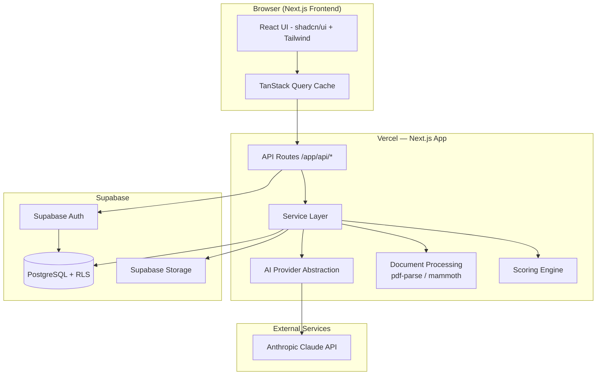
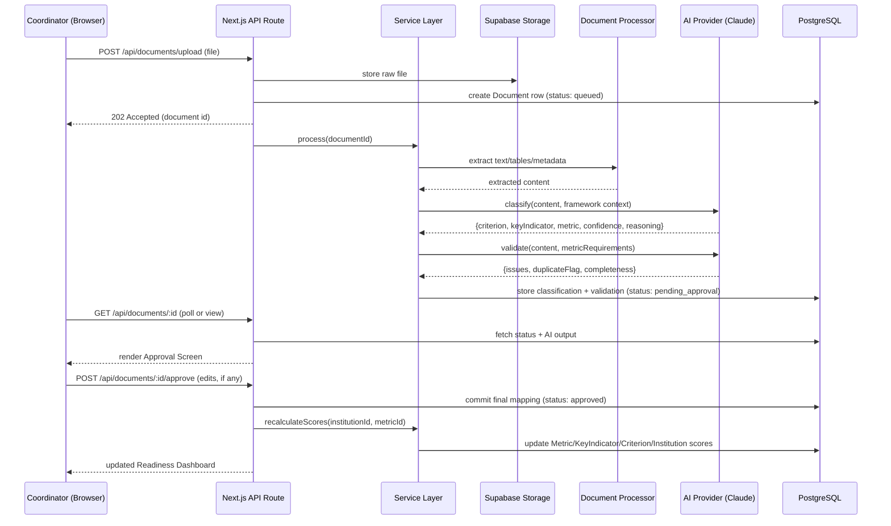
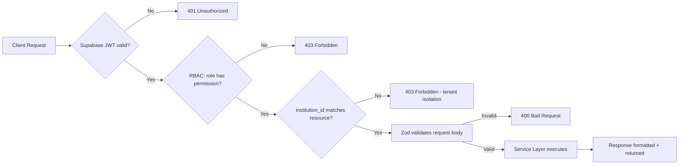
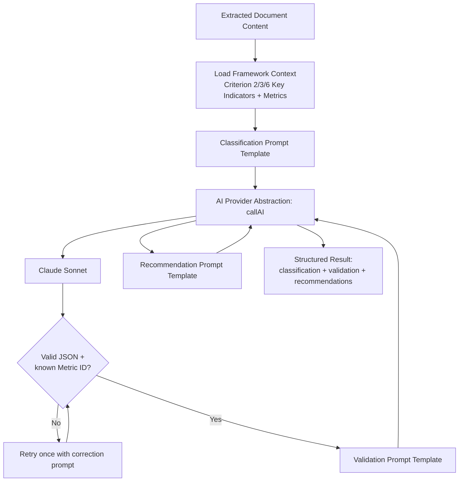

# AccrediAI — System Architecture (v1.0)

**Status:** Frozen for v1.0 build. Any change to this document during Days 3-10 requires flagging why the original design was insufficient, per standing rules.

## 1. Finalized Tech Stack

| Layer | Choice |
|---|---|
| Frontend | Next.js 15 (App Router), TypeScript, Tailwind CSS, shadcn/ui |
| Backend | Next.js API Routes, Service Layer Architecture |
| API Style | REST |
| Database | PostgreSQL (Supabase) |
| ORM | Prisma |
| Auth | Supabase Auth + JWT |
| Authorization | Role-Based Access Control (custom, DB-backed) |
| File Storage | Supabase Storage |
| AI Layer | Provider-abstracted; Claude Sonnet as default implementation |
| Document Processing | pdf-parse (PDF), mammoth (DOCX) |
| Prompt Management | Modular prompt template files |
| Validation | Zod |
| State Management | TanStack Query + React Context |
| Search | PostgreSQL Full-Text Search |
| Charts | Recharts |
| Deployment | Vercel |
| CI/CD | GitHub + Vercel Git Integration |

**Explicitly deferred to post-v1.0:** OCR (Tesseract), Sentry, Swagger/OpenAPI, Playwright/Vitest test suites, Husky/lint-staged.

---

## 2. Component Diagram



**Why this shape:** One deployable unit (Vercel) hosts frontend + API + service layer + AI orchestration, avoiding a separate backend service to deploy/monitor. Supabase supplies auth, DB, and storage as one managed platform — minimizing the number of external accounts/configs needed in a 10-day build. Claude is the only true external API dependency.

---

## 3. Data Flow — Core Evidence Workflow



---

## 4. Request Lifecycle (Typical Authenticated Request)



Every API route follows this exact order: **authenticate → authorize (role) → authorize (tenant) → validate input → execute → respond.** This order is fixed across all endpoints in API.md.

---

## 5. AI Interaction Detail



**AI Provider Abstraction contract:**
```ts
interface AIProvider {
  complete(promptTemplate: string, variables: Record<string, unknown>): Promise<string>;
}
// claudeProvider.ts implements this today.
// A future openAIProvider.ts or geminiProvider.ts can implement the same interface without touching Service Layer code.
```

---

## 6. External Services

| Service | Purpose | Failure Handling |
|---|---|---|
| Anthropic Claude API | Classification, validation, recommendations, Q&A, report drafting | Retry once on malformed JSON; on repeated failure, mark document `needs_review` rather than blocking upload |
| Supabase Auth | Login/session/JWT | Standard Supabase error surfaces as 401 |
| Supabase Storage | Evidence file storage | Upload failure surfaces as 502 with retry option in UI |
| Supabase Postgres | All persistent data | Connection errors surface as 503; no direct client-side DB access — always via API routes |

---

## 7. Multi-Tenancy Approach

Every table with institution-owned data carries `institution_id`. Two enforcement layers:
1. **Application layer:** Service Layer functions always take `institutionId` from the authenticated session (never from client input) and scope every query with it.
2. **Database layer:** Postgres Row-Level Security (RLS) policies on Supabase enforce `institution_id = current_setting('app.institution_id')` as a second, defense-in-depth layer — so even a bug in application code cannot leak cross-tenant data.

This satisfies the PRD's "strict data isolation" requirement with two independent safeguards, appropriate for an "enterprise-grade" positioning.
