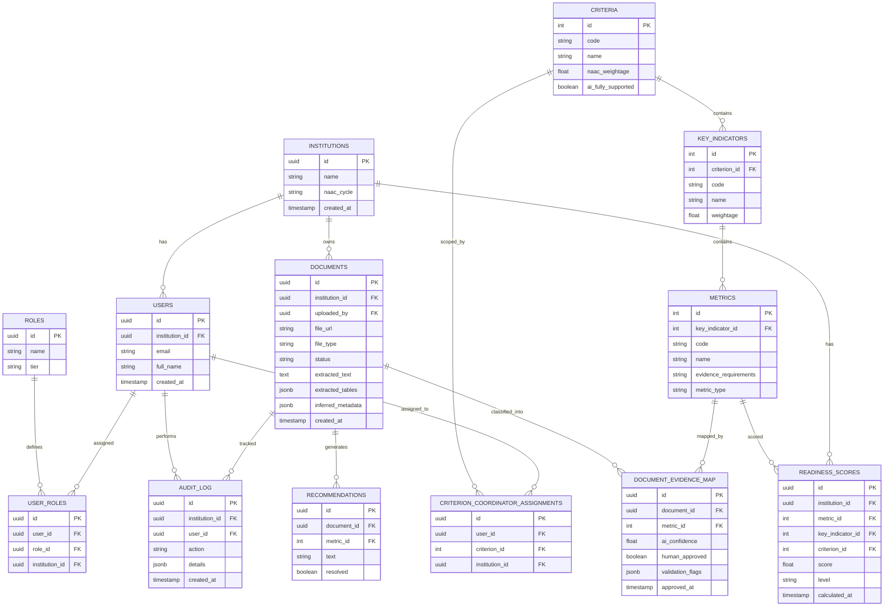

# AccrediAI — Database Schema (v1.0)

PostgreSQL via Supabase. Defined in Prisma schema syntax (conceptual — actual `schema.prisma` written Day 3). All tables except framework reference tables (`criteria`, `key_indicators`, `metrics`) carry `institution_id` for tenant isolation.

## Entity Relationship Diagram

## Table Notes & Constraints

### `institutions`
Root tenant table. `naac_cycle` (e.g. "2026-2031") supports future multi-cycle tracking.

### `users`
- `email` unique **within** `institution_id` (not globally — same email could theoretically belong to a consultant across institutions in future, though v1.0 doesn't need this; unique constraint is `(institution_id, email)`).
- FK to `institutions` cascades on institution deletion (demo/reset convenience).

### `roles` / `user_roles`
- `roles.tier` ∈ `{'full', 'simplified', 'foundational'}` — directly encodes the PRD's tiering (IQAC Coordinator/Criterion Coordinator = full; Principal/Faculty = simplified; the remaining four = foundational).
- A user can hold exactly one role per institution in v1.0 (`UNIQUE(user_id, institution_id)` on `user_roles`) — simplifies permission logic; multi-role users are a future enhancement.

### `criteria` / `key_indicators` / `metrics`
- Seeded once, globally shared (not per-institution) — this is reference data from NAAC's public framework, not tenant data.
- `criteria.ai_fully_supported` boolean flags Criteria 2, 3, 6 as `true`; the rest `false` — this single flag drives the "Coming in a future release" UI state from Blueprint Day 7, keeping that logic data-driven, not hardcoded per Criterion.
- `metrics.evidence_requirements` stores structured text (or JSON) describing what evidence NAAC expects — this is the grounding content injected into classification/validation prompts.

### `criterion_coordinator_assignments`
- Enforces which Criterion Coordinator can see/act on which Criteria; `UNIQUE(user_id, criterion_id, institution_id)`.

### `documents`
- `status` ∈ `{'queued','processing','pending_approval','approved','needs_review','rejected'}`.
- `file_type` ∈ `{'pdf','docx','image','excel'}` — image/excel rows are permitted but flagged lower-confidence downstream, per the best-effort scope decision.
- `extracted_tables`/`inferred_metadata` stored as `jsonb` for flexibility without new tables per field type.

### `document_evidence_map`
- Many-to-many bridge: a single document *can* map to more than one Metric (per the AI Recommendations flow: "this document also supports Criterion 7.1.2").
- `human_approved` is the field that turns AI suggestion into committed evidence; readiness scoring only counts rows where `human_approved = true`.
- `UNIQUE(document_id, metric_id)` prevents duplicate mapping rows.

### `readiness_scores`
- One row per (institution, level, level-specific id) — e.g. a Metric-level row has `metric_id` set and `key_indicator_id`/`criterion_id` null; a Criterion-level row has only `criterion_id` set. `level` column disambiguates (`'metric' | 'key_indicator' | 'criterion' | 'institution'`).
- Historical rows are **not** overwritten — new calculation inserts a new row with a fresh `calculated_at`, which directly powers the Day 8 "readiness trend over time" chart without needing a separate history table.

### `recommendations`
- Tied to the document that triggered them and the Metric they concern; `resolved` flips to true once the gap is closed by new/edited evidence (recalculated during scoring).

### `audit_log`
- Records every classification override, approval, and role change — supports the PRD's "continuous learning" logging requirement (corrections recorded, not auto-retrained) and gives judges a credible "this is enterprise-grade" artifact if asked about compliance/traceability.

---

## Validation Against PRD User Stories

| PRD Requirement | Schema Support |
|---|---|
| Multi-tenant data isolation | `institution_id` on every tenant table + RLS (see ARCHITECTURE.md §7) |
| 8 institutional roles, tiered functionality | `roles.tier` + `user_roles` |
| Criterion Coordinator scoped to assigned Criteria | `criterion_coordinator_assignments` |
| All 7 Criteria visible, 3 with full AI | `criteria.ai_fully_supported` flag |
| Document → Criterion/Key Indicator/Metric mapping with confidence | `document_evidence_map.ai_confidence` |
| Evidence validation (duplicates, missing fields) | `document_evidence_map.validation_flags` (jsonb) |
| Human-in-the-loop approval | `document_evidence_map.human_approved` + `documents.status` |
| Explainable Metric→KeyIndicator→Criterion→Institution scoring | `readiness_scores.level` hierarchy, always joinable back to contributing `document_evidence_map` rows |
| Gap detection + recommendations | `recommendations` table, linked to `metric_id` |
| Continuous learning (logging only) | `audit_log` |
| AQAR/SSR generation grounded in approved evidence | Query: `documents JOIN document_evidence_map WHERE human_approved = true AND metric_id IN (...)` |
| AI Q&A grounded search | Full-text search index on `documents.extracted_text`, scoped by `institution_id` and `ai_fully_supported` criteria |

Every user story from the PRD has a direct schema path — no gaps identified.
