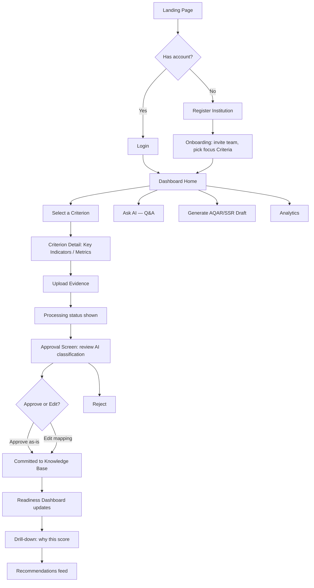
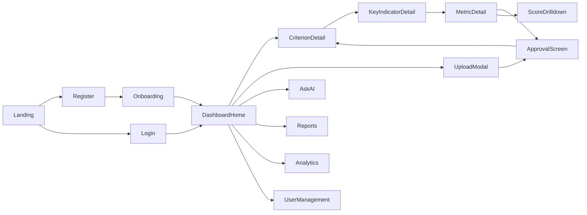

# AccrediAI — UI & User Flow (v1.0)

## 1. User Flow Diagram — Core Journey (IQAC Coordinator)



## 2. Screen Flow — Full Screen List



Every screen exists to serve one part of the PRD's core loop or a named supporting feature — nothing here is decorative. `UserManagement` exists because IQAC Coordinator invites/manages roles (PRD §7.1); `Onboarding` exists because institution registration must feel like a real SaaS product, not a bare form (PRD Day 10 polish requirement).

---

## 3. Low-Fidelity Wireframes

### 3.1 Dashboard Home (IQAC Coordinator)
```
┌──────────────────────────────────────────────────────────────────┐
│ AccrediAI      [Search evidence...]           🔔  Jane K. (IQAC) ▾│
├───────────┬────────────────────────────────────────────────────────┤
│ Dashboard │  Institution Readiness: 68%  ▲ +4% this month          │
│ Criteria  │  ┌────────────────────────────────────────────────┐    │
│  1 2 3 4  │  │  [chart: readiness trend over time]             │    │
│  5 6 7    │  └────────────────────────────────────────────────┘    │
│ Ask AI    │                                                        │
│ Reports   │  Criterion Cards (7):                                  │
│ Analytics │  ┌────────┐┌────────┐┌────────┐┌────────┐              │
│ Users     │  │C1 62%  ││C2 74%●││C3 81%●││C4 —    │              │
│           │  │structure││ AI live││ AI live││ soon   │              │
│           │  └────────┘└────────┘└────────┘└────────┘              │
│           │  ┌────────┐┌────────┐┌────────┐                        │
│           │  │C5 —    ││C6 70%●││C7 —    │  ● = AI fully supported │
│           │  │ soon   ││ AI live││ soon   │                        │
│           │  └────────┘└────────┘└────────┘                        │
│           │                                                        │
│           │  Recent Recommendations:                               │
│           │  • Metric 2.3.1 — attendance sheet missing   [Upload]  │
│           │  • Metric 6.1.2 — signed policy needed        [Upload] │
│           │                                                        │
│           │              [ + Upload Evidence ]                     │
└───────────┴────────────────────────────────────────────────────────┘
```

### 3.2 Criterion Detail → Metric List
```
┌──────────────────────────────────────────────────────────────────┐
│ ← Back to Dashboard        Criterion 3: Research, Innovation &Ext. │
├──────────────────────────────────────────────────────────────────┤
│ Criterion Score: 81%                         [ + Upload Evidence ]│
│                                                                    │
│ Key Indicator 3.1 — Resource Mobilization for Research   Score 78%│
│   Metric 3.1.1  ●Sufficient   4 documents                        │
│   Metric 3.1.2  ▲Weak         1 document — missing dates         │
│   Metric 3.1.3  ✕Missing      0 documents            [Upload →]  │
│                                                                    │
│ Key Indicator 3.2 — Innovation Ecosystem                Score 85%│
│   Metric 3.2.1  ●Sufficient   6 documents                        │
│   ...                                                             │
└──────────────────────────────────────────────────────────────────┘
```

### 3.3 Upload Widget (modal/drawer)
```
┌───────────────────────────────────────┐
│  Upload Evidence                    ✕ │
├───────────────────────────────────────┤
│   ┌─────────────────────────────────┐  │
│   │   Drag files here, or Browse    │  │
│   │   PDF, DOCX (Excel/images:      │  │
│   │   best-effort support)          │  │
│   └─────────────────────────────────┘  │
│   research_mou_2025.pdf   ▓▓▓▓▓░ 80%  │
│   feedback_report.docx    ✓ Queued    │
│                                        │
│                    [ Upload & Analyze ]│
└───────────────────────────────────────┘
```

### 3.4 Approval Screen (core human-in-the-loop step)
```
┌──────────────────────────────────────────────────────────────────┐
│ Review AI Classification                                          │
├──────────────────────────────────────────────────────────────────┤
│ File: research_mou_2025.pdf         [ preview panel: extracted    │
│                                        text/metadata ]            │
│ AI suggests:                                                      │
│   Criterion 3 → Key Indicator 3.1 → Metric 3.1.2   (91% confident)│
│   [ Edit mapping ▾ ]                                              │
│                                                                    │
│ Validation flags:                                                 │
│   ⚠ Missing signature page                                        │
│   ⚠ No duplicate detected                                         │
│                                                                    │
│ AI Recommendations:                                                │
│   • This document also supports Criterion 7.1.2                  │
│   • A signed cover letter is recommended                          │
│                                                                    │
│              [ Reject ]              [ Approve & Commit ]         │
└──────────────────────────────────────────────────────────────────┘
```

### 3.5 Score Drilldown ("why this score")
```
┌──────────────────────────────────────────────────────────────────┐
│ Metric 3.1.2 — Readiness: 54% (Weak)                    ✕ Close  │
├──────────────────────────────────────────────────────────────────┤
│ Contributing Evidence:                                            │
│   • research_mou_2025.pdf  — 91% confidence, missing signature   │
│                                                                    │
│ Gaps:                                                              │
│   • Signed copy required per NAAC Metric 3.1.2 guideline          │
│                                                                    │
│ Recommended Actions:                                               │
│   1. Upload signed version of the MoU                             │
│   2. Add supporting collaboration outcome report                  │
└──────────────────────────────────────────────────────────────────┘
```

### 3.6 Ask AI (Q&A)
```
┌──────────────────────────────────────────────────────────────────┐
│ Ask AI                                                             │
├──────────────────────────────────────────────────────────────────┤
│  You: Do we have signed MoUs for Criterion 3?                     │
│  AI: You have 3 MoUs uploaded for Criterion 3. One (with XYZ      │
│      College) is missing a signature page. [research_mou_2025.pdf]│
│                                                                    │
│  [ Type your question...                              ] [ Send ] │
└──────────────────────────────────────────────────────────────────┘
```

### 3.7 Simplified Dashboards (Principal / Faculty)
```
Principal — read-only:                  Faculty — own submissions:
┌───────────────────────────┐           ┌───────────────────────────┐
│ Institution Readiness: 68%│           │ My Uploads                │
│ [7 Criterion cards, view- │           │  cert_workshop.pdf ✓ Appr │
│  only, no upload button]  │           │  paper_draft.docx ⏳ Pend │
│ [Analytics summary]       │           │        [ + Upload ]        │
└───────────────────────────┘           └───────────────────────────┘
```

---

## 4. Navigation Structure

- **Persistent left sidebar** (role-dependent items): Dashboard, Criteria (1-7), Ask AI, Reports, Analytics, Users (IQAC Coordinator only).
- **Top bar:** global evidence search, notifications (new recommendations), user/role indicator, logout.
- **Criterion Coordinator** sees only their assigned Criteria in the sidebar list (not all 7) — enforced both in UI rendering and API scoping.
- **Foundational roles** (NAAC Coordinator, HOD, Data Entry Operator, Institution Admin) land on a single placeholder dashboard reading "Full workspace coming in a future release" with only profile/logout available — honest, not broken-feeling.

## 5. Screen Justification Summary

| Screen | Why it exists |
|---|---|
| Dashboard Home | Institution-wide readiness at a glance — PRD's headline value |
| Criterion Detail | Drill-down entry point into Key Indicators/Metrics |
| Upload Widget | Core loop entry point |
| Approval Screen | Human-in-the-loop requirement — non-negotiable per PRD |
| Score Drilldown | Explainability principle — every score must show its "why" |
| Ask AI | 🟡 supporting feature per frozen scope |
| Reports (AQAR/SSR) | 🟡 supporting feature per frozen scope |
| Analytics | 🟡 focused analytics per frozen scope |
| Users | RBAC/invite management — needed for IQAC Coordinator's real workflow |
| Simplified Principal/Faculty views | Fulfill PRD's tiered-role commitment without overbuilding |
